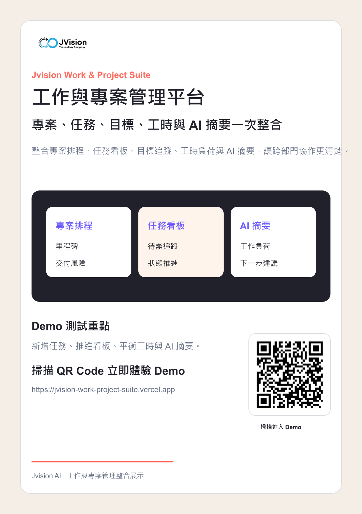

# Jvision 工作與專案管理平台

整合專案排程、任務看板、目標追蹤、工時負荷與 AI 摘要的互動 Demo，讓跨部門協作更清楚。

## 線上 Demo

[https://jvision-work-project-suite.vercel.app](https://jvision-work-project-suite.vercel.app)

## 行銷海報



## 檔案

- [海報 PNG](./docs/marketing/jvision-work-project-suite-poster.png)
- [海報 PDF](./docs/marketing/jvision-work-project-suite-poster.pdf)
- [產品介紹 PDF](./docs/marketing/jvision-work-project-suite-product-introduction.pdf)
- [線上海報 PNG](https://jvision-work-project-suite.vercel.app/jvision-work-project-suite-poster.png)
- [線上產品介紹 PDF](https://jvision-work-project-suite.vercel.app/jvision-work-project-suite-product-introduction.pdf)

## Demo 功能

- 新增任務與專案資訊
- 推進任務看板狀態
- 平衡成員工作負荷
- 更新目標進度
- 產生 AI 工作摘要

## 指令

```bash
npm install
npm run build
npm run assets
npm run verify
```
